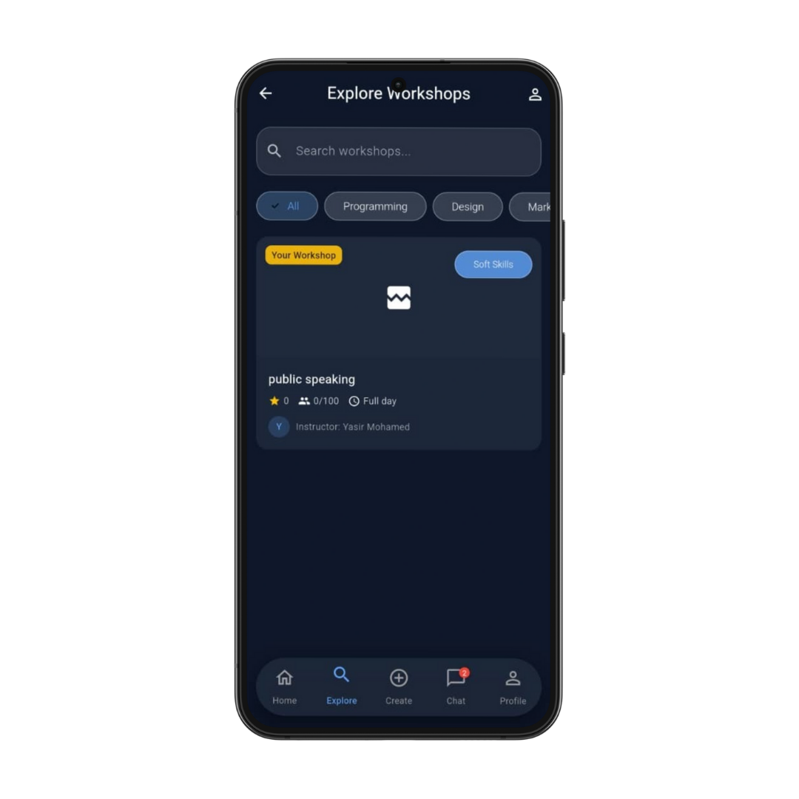
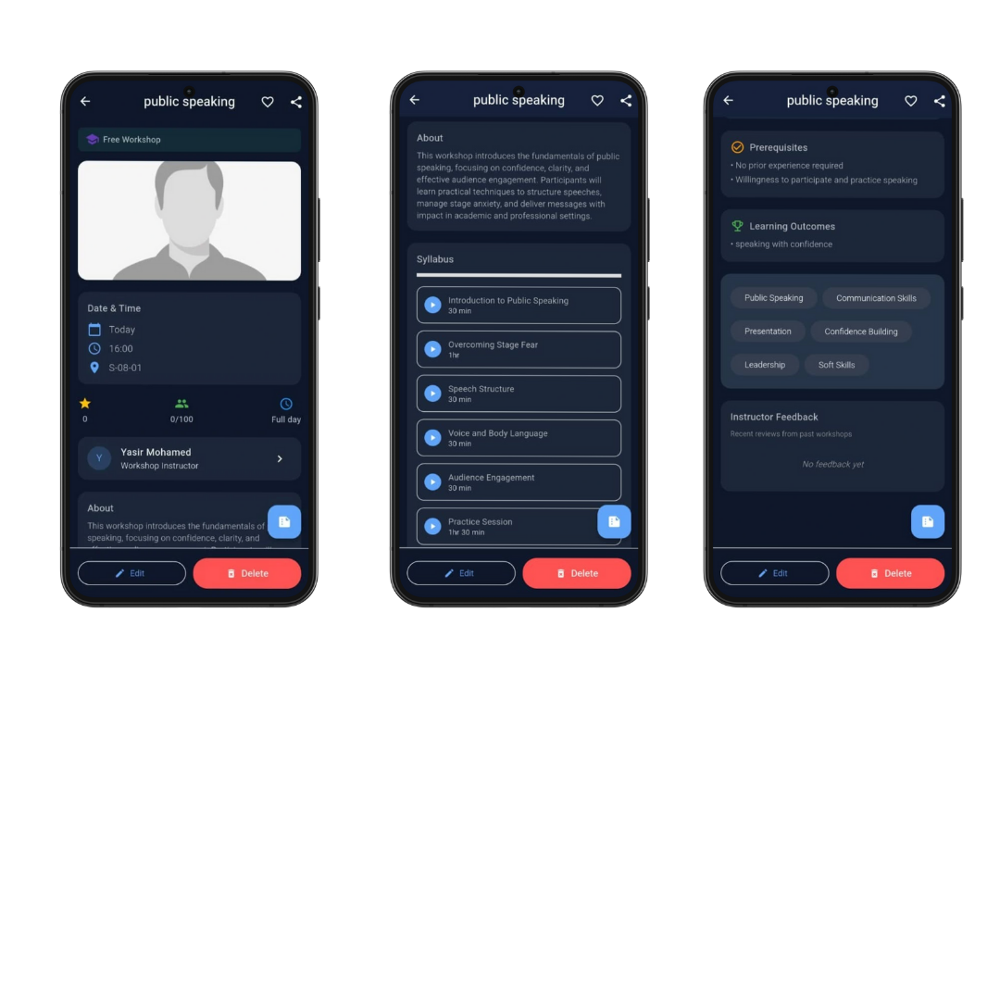
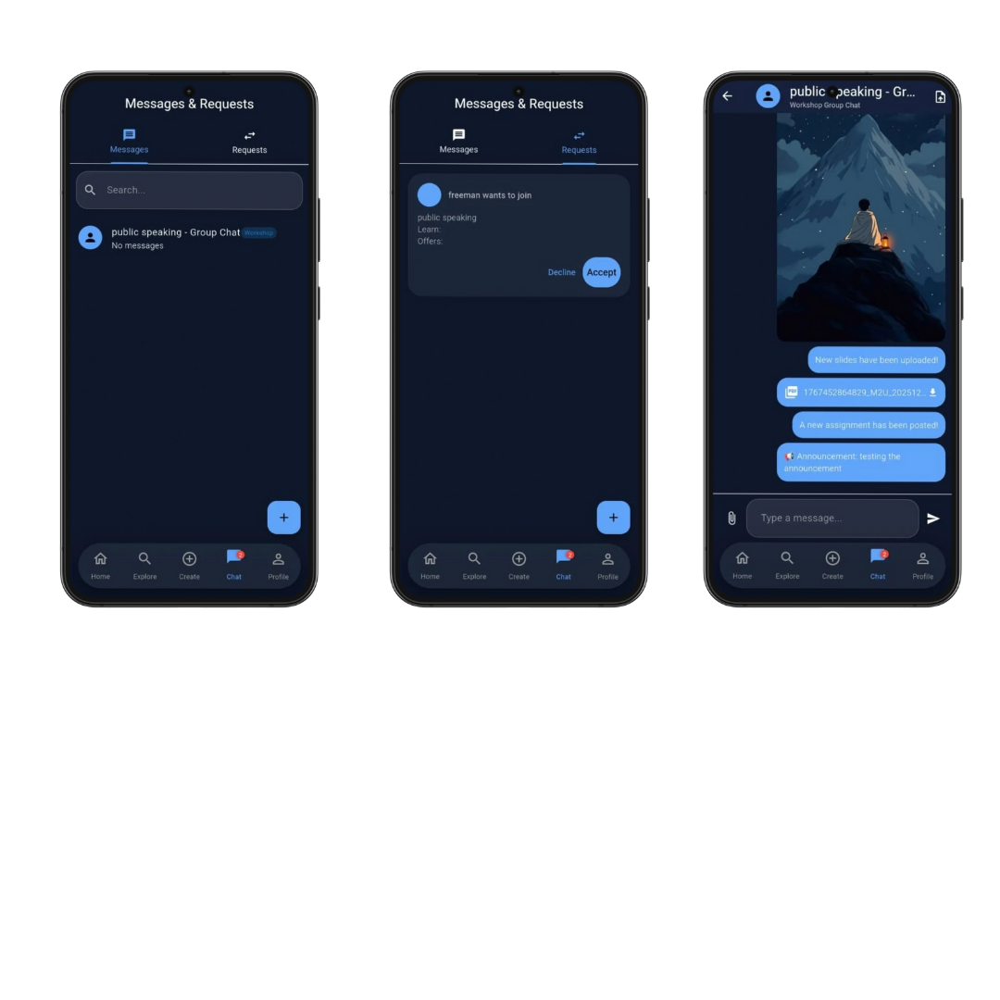
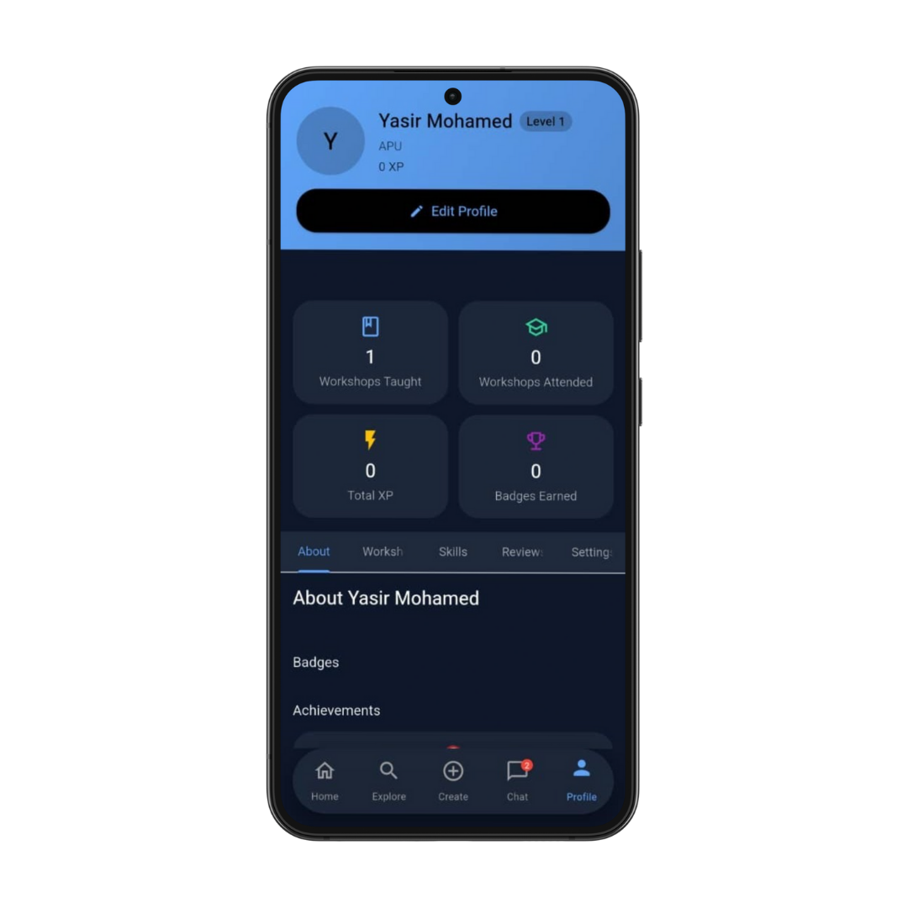
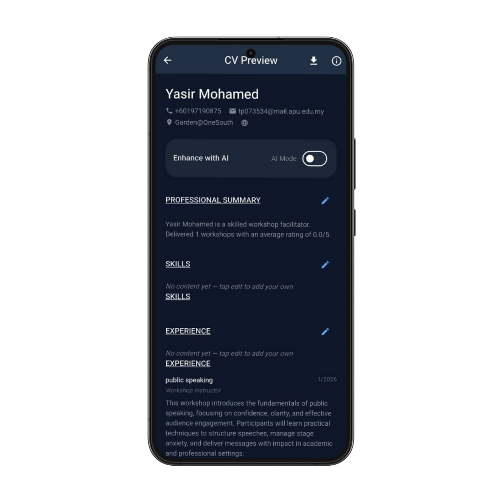
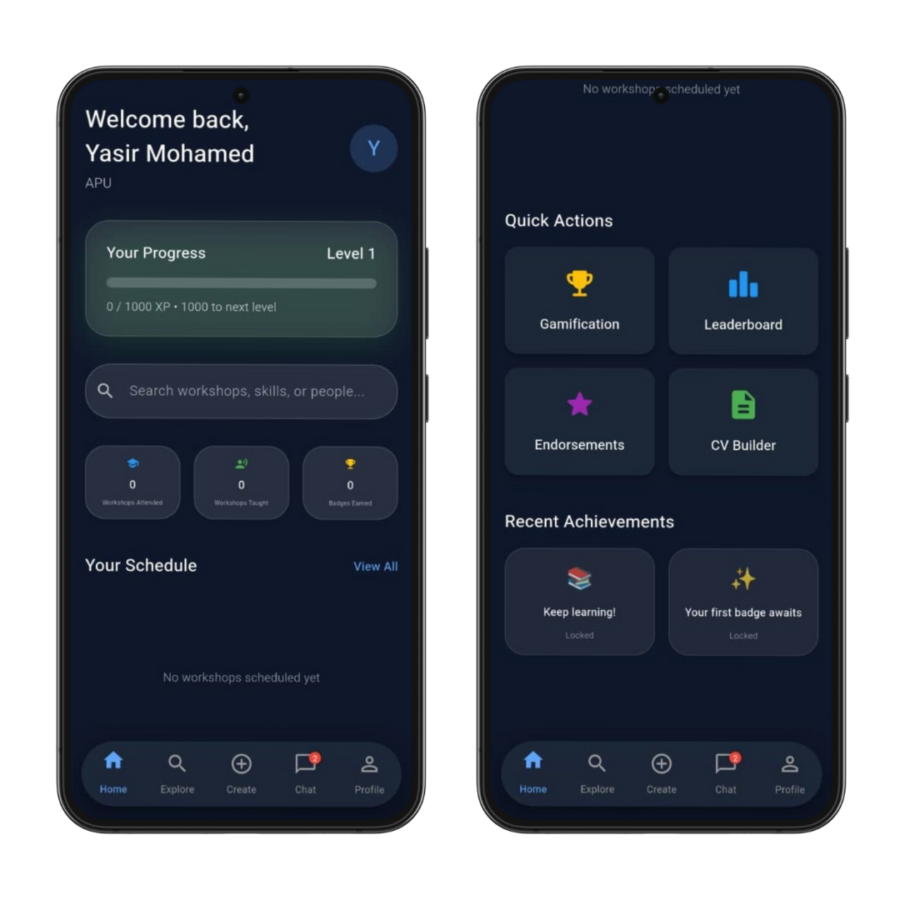

# SkillX - Peer-to-Peer Skill Exchange Platform
<div align="center">
    
  <!-- Adjust width as needed (e.g., 300–600) -->

  <br/><br/>

  [](https://flutter.dev)
  [](https://supabase.com)
  [](LICENSE)

  <h3>A modern mobile platform connecting students and educators through skill-sharing workshops</h3>

  <br/>

  <!-- Optional: Add hero screenshots below the logo -->
  
  
  
  
  

  <br/><br/>

  [Features](#-features) • [Tech Stack](#-tech-stack) • [Getting Started](#-getting-started) • [Architecture](#-architecture) • [Contributing](#-contributing)
</div>


## 📖 Overview

SkillX is a comprehensive peer-to-peer learning platform that enables university students to create, discover, and participate in skill-sharing workshops. Built with Flutter and Supabase, it combines workshop management, real-time chat, gamification, and professional CV building into a seamless mobile experience.

### 🎯 Core Mission
Supporting **UN SDG 4: Quality Education** by democratizing learning and making peer-to-peer education accessible to all students.

---

## ✨ Features

### 🎓 Workshop Management
- **Create & Host Workshops**: Design comprehensive workshops with syllabus, prerequisites, and learning outcomes
- **Two Workshop Types**:
  - **Free Workshops**: Traditional teaching sessions
  - **Teach4Learn**: Skill exchange marketplace (teach one skill, learn another)
- **Smart Enrollment**: Request-based system with creator approval
- **Live Progress Tracking**: Real-time syllabus completion monitoring
- **AI-Powered Summaries**: Automatic workshop descriptions using Hugging Face models

### 💬 Real-Time Communication
- **Group Chats**: Automatic chat creation for each workshop
- **1-on-1 Messaging**: Direct communication between participants
- **File Sharing**: Support for images, PDFs, and documents
- **Read Receipts**: Message status tracking
- **Workshop Materials**: Instructors can share slides and assignments

### 🏆 Gamification System
- **XP & Leveling**: Earn experience points for participation and teaching
- **Badge System**: Unlock achievements with 5 rarity tiers (Common → Legendary)
- **Dynamic Leaderboard**: Compete with peers in real-time
- **Achievement Tracking**: Monthly and milestone-based challenges
- **Progress Rewards**: Automatic badge unlocks tied to user activity

### 📄 CV Builder
- **Auto-Generated CVs**: Professional resumes built from actual platform activity
- **Skills Verification**: Endorsements from workshop participants
- **Workshop Portfolio**: Showcase teaching experience with ratings
- **AI Enhancement**: Optional AI-powered content refinement
- **PDF Export**: Download publication-ready CVs
- **LinkedIn Integration**: One-click profile updates

### 🔍 Smart Discovery
- **AI-Powered Matching**: Personalized workshop recommendations (up to 100% match scores)
- **Advanced Filters**: Category, difficulty, duration, and type filtering
- **User Search**: Find peers by name, skills, or interests
- **Review System**: Rate and review workshops post-completion

### 🔔 Notifications & Reminders
- **Workshop Alerts**: 15-minute pre-start reminders
- **New Workshop Notifications**: Instant alerts for fresh content
- **Badge Unlocks**: Celebrate achievements in real-time
- **Chat Messages**: Push notifications for new messages

---

## 🛠 Tech Stack

### Frontend
- **Flutter 3.x**: Cross-platform mobile development
- **Provider**: State management
- **Material Design 3**: Modern UI components

### Backend & Database
- **Supabase**: PostgreSQL database, authentication, real-time subscriptions
- **Row-Level Security (RLS)**: Fine-grained access control
- **Edge Functions**: Serverless TypeScript functions for secure operations

### Key Libraries
| Library | Purpose |
|---------|---------|
| `supabase_flutter` | Backend integration |
| `flutter_local_notifications` | Push notifications |
| `pdf` & `printing` | CV generation |
| `image_picker` | File uploads |
| `http` | API requests |
| `shared_preferences` | Local storage |
| `app_links` | Deep linking |

### AI Integration
- **Hugging Face API**: Text generation (Llama 3.1, Qwen 2.5, Gemma 2)
- **CV Enhancement**: Professional summary, skills, and experience generation

---

## 🚀 Getting Started

### Prerequisites
```bash
Flutter SDK 3.0+
Dart 3.0+
Android Studio / Xcode
Supabase account
```

### Installation

1. **Clone the repository**
```bash
git clone https://github.com/yourusername/skillx.git
cd skillx
```

2. **Install dependencies**
```bash
flutter pub get
```

3. **Configure Supabase**
- Create a new Supabase project at [supabase.com](https://supabase.com)
- Update credentials in `lib/main.dart`:
```dart
await Supabase.initialize(
  url: 'YOUR_SUPABASE_URL',
  anonKey: 'YOUR_SUPABASE_ANON_KEY',
);
```

4. **Set up database**
- Run the SQL script from `lib/SQL code` in your Supabase SQL editor
- Enable Realtime for `messages` and `workshops` tables

5. **Deploy Edge Functions**
```bash
supabase functions deploy delete-account
supabase functions deploy send-deletion-email
```

6. **Configure environment variables**
- Add `RESEND_API_KEY` for email functionality
- Add Hugging Face API key in `lib/services/hugging_face_service.dart`

7. **Run the app**
```bash
flutter run
```

---

## 🏗 Architecture

### Database Schema
```
users
├── Basic profile (name, email, bio, university)
├── Skills (skills_to_teach, skills_to_learn)
├── Gamification (xp, level)
└── Social links

workshops
├── Workshop details (title, description, category)
├── Schedule (date, time, location)
├── Syllabus (lessons array)
├── Enrollment (max_participants)
└── Conversation (group chat)

gamification
├── badge_definitions (rarity, requirements)
├── user_badges (progress, earned_at)
├── achievement_definitions
└── user_achievements

chat
├── conversations (1-on-1 or group)
├── messages (text, images, files)
└── conversation_participants
```

### Key Features Implementation

#### Workshop Recommendation Algorithm
```dart
double calculateMatch(workshop) {
  score = 0.0;
  
  // Category match (20%)
  if (userPreferredCategory == workshop.category) score += 20;
  
  // Difficulty alignment (15%)
  if (workshop.difficulty == 'Beginner' || 'Intermediate') score += 15;
  
  // Skills overlap (25%)
  if (userSkillsToLearn ∩ workshop.tags) score += 25;
  
  // Teach4Learn compatibility (20%)
  if (userCanTeach(workshop.skillRequested)) score += 20;
  
  // Prerequisites (10%)
  if (userMeets(workshop.prerequisites)) score += 10;
  
  return clamp(score, 0, 100);
}
```

#### Real-Time Chat
- PostgreSQL `LISTEN/NOTIFY` via Supabase Realtime
- Automatic read receipts with `read_at` timestamps
- File uploads to Supabase Storage (`chat-files` bucket)

#### Gamification Logic
```sql
-- Auto-award XP on lesson completion
CREATE FUNCTION mark_lesson_complete() 
  AWARDS 10 XP (student) + 5 XP (instructor)
  CHECKS badge progress
  NOTIFIES users on unlock
```

---

## 📱 Screenshots

| Home Dashboard | Workshop Detail | Chat Interface | CV Builder |
|---------------|----------------|----------------|-----------|
|  |  |  |  |

---

## 🔐 Security Features

- **Email Verification**: Required for all new accounts
- **Domain Restrictions**: Configurable university email enforcement (`@mail.apu.edu.my`)
- **Secure Deletion**: 3-day token-based account deletion flow
- **RLS Policies**: Every table protected with row-level security
- **Password Updates**: Re-authentication required for password changes
- **Edge Functions**: Sensitive operations (user deletion) via server-side TypeScript

---

## 🧪 Testing

### Unit Tests
```bash
flutter test
```

### Integration Tests
```bash
flutter drive --target=test_driver/app.dart
```

### Key Test Coverage
- Authentication flows
- Workshop creation/enrollment
- Chat message sending
- Gamification XP calculation
- CV generation

---

## 🤝 Contributing

We welcome contributions! Please follow these steps:

1. Fork the repository
2. Create a feature branch (`git checkout -b feature/AmazingFeature`)
3. Commit changes (`git commit -m 'Add AmazingFeature'`)
4. Push to branch (`git push origin feature/AmazingFeature`)
5. Open a Pull Request

### Code Style
- Follow [Effective Dart](https://dart.dev/guides/language/effective-dart)
- Use `flutter format` before committing
- Add comments for complex logic

---

## 📋 Roadmap

### Q1 2025
- [ ] iOS release
- [ ] Multi-language support
- [ ] Video chat integration
- [ ] Workshop recordings

### Q2 2025
- [ ] Payment integration for premium workshops
- [ ] Certificate generation
- [ ] Mobile web version
- [ ] Advanced analytics dashboard

### Q3 2025
- [ ] AI teaching assistant
- [ ] Blockchain skill verification
- [ ] Cross-university partnerships

---

## 🐛 Known Issues

1. **Android 13+ Notifications**: Require explicit runtime permission
2. **PDF Generation**: Large CVs may take 5-10 seconds
3. **Realtime Channels**: Occasional reconnection delays on poor networks

See [Issues](https://github.com/yourusername/skillx/issues) for full list.

---

## 📄 License

This project is licensed under the MIT License - see [LICENSE](LICENSE) file for details.

---

## 👥 Team

**SkillX Development Team**
- Lead Developer: [Yasir Mohamed Abdinur](https://github.com/yourusername](https://github.com/muraa-p))
- UI/UX Designer: [Yasir Mohamed Abdinur]
- Backend Engineer: [Yasir Mohamed Abdinur]

---

## 🙏 Acknowledgments

- [Flutter Team](https://flutter.dev) for the amazing framework
- [Supabase](https://supabase.com) for backend infrastructure
- [Hugging Face](https://huggingface.co) for AI capabilities
- [Material Design](https://m3.material.io) for design guidelines
- APU University for project support

---

## 📞 Support

- **Email**: yasirmhaji@gmail.com
- **Discord**: [Join our community](https://discord.gg/skillx)
- **Documentation**: [docs.skillx.app](https://docs.skillx.app)
- **Twitter**: [@SkillXApp](https://twitter.com/skillxapp)

---

<div align="center">

**Made with ❤️ by students, for students**

[⬆ Back to Top](#skillx---peer-to-peer-skill-exchange-platform)

</div>
